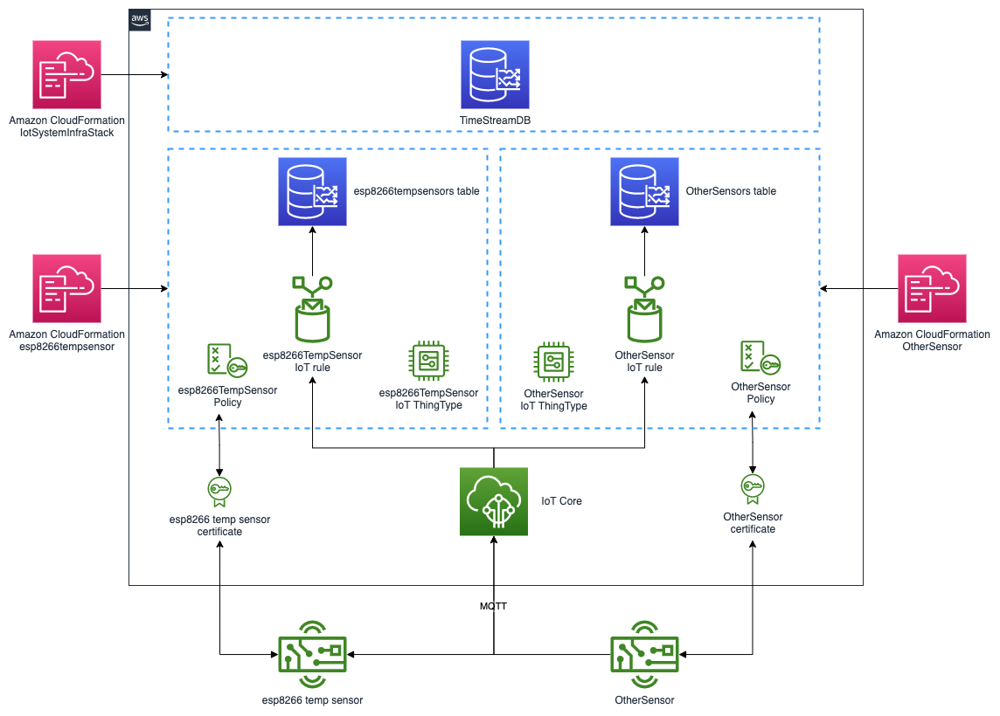
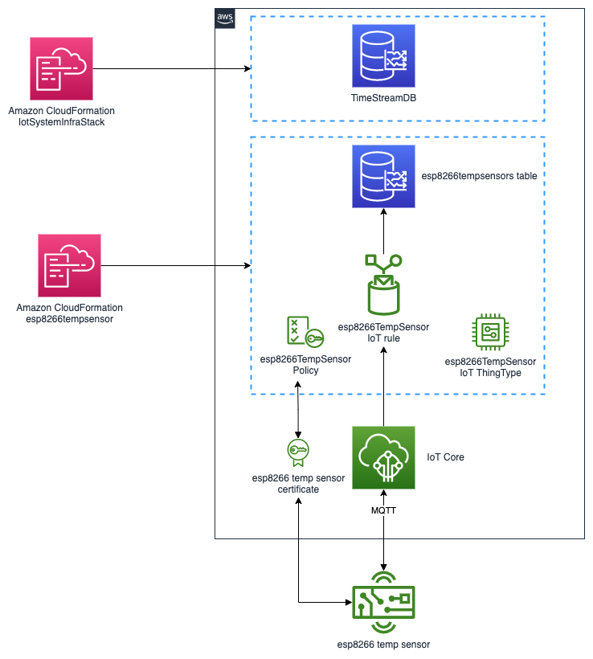

# IoT System

This project shows an opinionated manner to manage my IoT devices using AWS IoT Core.

The project is developed using AWS CDK and is structured around a central Amazon TimeStream database. This central database as well as the core system is deployed using the iotSystemInfraStack CDK stack.

Then each sensors have their own folder containing their stack and code. Each sensor is completely independant from the other ones.

The objective is to easily add new sensor types when needed.




## Solution Architecture

As shown in the architecture diagram, the IoTSystemInfra stack deploy the Amazon Timestream database that will host various tables.

Then, when we deploy a sensor type, a new stack is deployed to handle the sensor infrastructure and business logic. The stack create a thing type, a policy and an AWS IoT Rule associated with the sensor type. When a new sensor is added, a certificate will be associated with the sensor and the newly created policy to allow the sensor to send data in IoTCore.

The communication is done in MQTT, using the following structure: /THINGTYPE/THINGNAME



## Code structure

The code has an opinionated folder structure.

The deployment is performed using AWS CDK and a makefile.

```
iotSystem/
    |
    |- Makefile
    |
    |- certificates/ 
    |
    |- iot_system_infra/    
    |   |- iot_system_infra_stack.py
    |
    |- esp8266tempsensors/
    |   |- esp8266tempsensors.py
    |   |- code/
    |   |- sensors/
````

There is a certificate folder where the things certificates will be stored.

There is a folder per sensor type (e.g. esp8266tempsensors for temperature sensors based on esp8266).

In this folder, there is the CDK stack code, a code folder where the source code of the sensor itself is stored and a sensors folder. The sensors folder contains deployment packages for each sensors. For example, when we create a new esp8266tempsensor, the makefile will build the required infra on AWS side (certificate and thing) but will also convert the certificate files to the right esp8266 format and tune the code (write the iotCore endpoint, the wifi ssid and password and the thing name). Thus, at the end of the process, the operator just has to copy the generated package in the esp8266 board.


## Application Deployment

### pre requisite
To deploy this project, you need an AWS account. You also need the AWS cli and CDK cli installed and configured on your development environment. You also need to have the jq software installed.

### deployment

- Clone the project on your local machine

- create the environment
```
$ python3 -m venv .venv
```

After the init process completes and the virtualenv is created, you can use the following
step to activate your virtualenv.

```
$ source .venv/bin/activate
```

Once the virtualenv is activated, you can install the required dependencies.

```
$ pip install -r requirements.txt
```

- execute the make all command

```
make all dbName=YOURDBNAME
```

**NOTE:** If you already have an Amazon Timestream database that you want to reuse, you can deploy only the "sensor" part. To do this, execute the make command with the sensor type and the database name.

for example:
```
make esp8266TempSensor name=YOURDBNAME
```

### Commands to create and delete things

* `make esp8266TempSensorCreate name=THINGNAME wifissid=WIFI_SSID wifipassword=WIFI_PASSWORD` Create a new esp8266TempSensor

* `make esp8266TempSensorDelete name=THINGNAME` delete the THINGNAME sensor

## Additional note
The esp8266TempSensor is implemented in micro python on esp8266 devices flashed with the following firmware:

You can copy the files on the device using the esptool.py